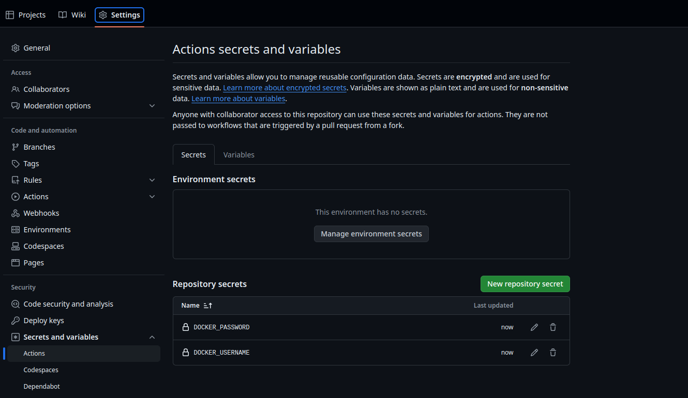

# CodeWeavers BackendAPI

Django Rest Backend API for Code Weavers website.

[](https://github.com/KenMwaura1/BackendAPI/actions/workflows/pythonapp.yml)


## Overview

This is an open-source Backend API for the Code Weavers website. It utilizes Django for the backend, Django Rest Framework for the API, and Docker for containerization.

## Prerequisites

Ensure you have the following installed on your machine:
* [Python 3.11+](https://www.python.org/downloads/)
* [Django](https://www.djangoproject.com/download/)
* Postgresql Database.
  * This could either be installed [locally](https://www.postgresql.org/) or via  [docker](https://www.docker.com/).
  * This [article](https://blog.crunchydata.com/blog/easy-postgresql-12-and-pgadmin-4-setup-with-docker) is an awesome resource on how to get Postgresql and pgadmin4  installed as containers.
      
  * Create a database `codeweavers`. Either using SQL or 3-party client like pgadmin4 or [dbeaver](https://dbeaver.io/)

* [Docker](https://www.docker.com/)
* [Docker Compose](https://docs.docker.com/compose/install/)
  
## Setup and Run

1. Navigate to the Repository:

 Visit [CodeWeaversAfrica/BackendAPI](https://github.com/CodeWeaversAfrica/BackendAPI).

2. Fork the Repository:

* On the top-right corner of the repository page, click on the **Fork** button.
* Choose your GitHub account as the destination.
* Wait for GitHub to complete the forking process. This might take a few moments.
  
3. Clone the Repo

 Clone the forked repository to your local machine:

 ```sh
 git clone https://github.com/your-username/BackendAPI.git
 ```

4. Move into the directory

 ```sh
 cd BackendAPI
 ```
## Choose Your Setup Method
You can either use Docker or set up a virtual environment locally.
### 1. Using Docker
This project is set up to run with Docker. For simplicity, we've created custom scripts and user-friendly commands using a Makefile. All necessary Docker commands and configurations are documented in docker.txt and commands.txt.
Note that when using Docker, you don't need to set up a virtual environment.
### Copy the provided example file to your .env.dev file

   ```sh
   cp .env.dev.example .env.dev
   ```

 * Update the .env.dev file with your required environment variables.
### Build and run cointainers

```sh
make build-up
```
### Access the server
Access the application on http://localhost:8000 in your browser.
### Additional Resources:

* For Docker setup instructions, refer to docker.txt.
* For running commands inside the Docker environment, refer to commands.txt.

### 2. Running locally in a virtual environment
###  Create a virtual environment

   ```sh
   python -m venv venv
   ```

### Activate the virtual environment
#### 1. Windows
   ```sh
   venv\Scripts\activate
   ```
#### 2. macOS/Linux   

   ```sh
   source venv/bin/activate
   ```

### Install the dependencies

   ```sh
   pip install -r requirements.txt
   ```

### Copy the provided example file to your .env.dev file

   ```sh
   cp .env.dev.example .env.dev
   ```

 * Update the .env.dev file with your required environment variables.
  
### Run the server

   ```sh
   python manage.py runserver
   ```


## Github Actions

Github actions are used to run tests and build the docker image. The docker image is pushed to [Docker Hub](https://hub.docker.com/repository/docker/kenmwaura1/backendapi/general). Inorder to effectively use the actions you will need to add the following secrets to your repository settings. `DOCKER_USERNAME` and `DOCKER_PASSWORD` for the docker hub account.
This is to enable the docker login step in the workflow and push the image to the docker hub repository. Alternatively you can remove the step from the workflow by commenting it out.



The docker image is also tagged with the commit sha and pushed to the docker hub repository. This is to enable the image to be pulled by the docker-compose file in the root directory. The docker-compose file is used to spin up the containers locally. It is available on [Github Packages](https://github.com/KenMwaura1/BackendAPI/pkgs/container/backendapi) as well.

## Contributing

We welcome contributions to this project! Please refer to our CONTRIBUTING.md file for guidelines on contributing. Your help is highly appreciated!

## License

Distributed under the MIT License. See `LICENSE` for more information.
